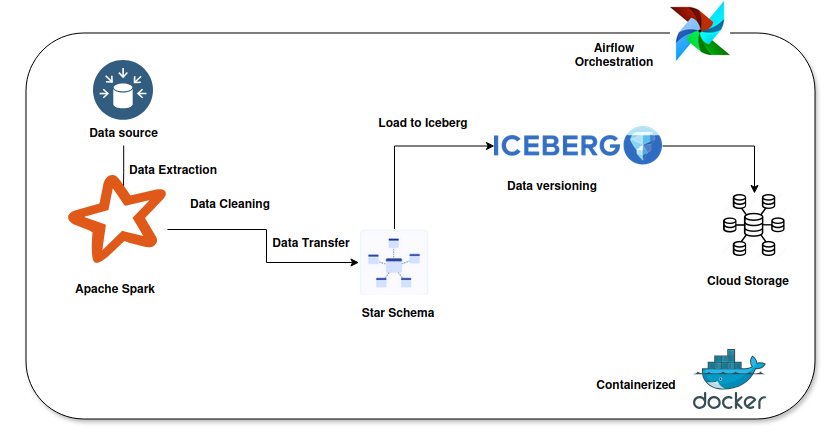

# E-Commerce Data Warehouse


## Project Overview:
This project sets up an E-commerce Data Warehouse to ingest, clean, and transform raw e-commerce transaction data. The pipeline orchestrates multiple tasks, including data extraction, transformation, and loading (ETL), with orchestration provided by Apache Airflow. Data is processed using PySpark and stored in a star schema format within an Apache Iceberg data warehouse.

#### Key Features:
- **Data Orchestration**: Apache Airflow is used to schedule and manage ETL workflows.
- **Data Processing**: PySpark cleans, standardizes, and transforms the raw data.
- **Data Warehouse**: Apache Iceberg is used as a modern data lake/warehouse to store the transformed data in a star schema.
- **Containerization**: Docker Compose is used to containerize all services for ease of deployment and scalability.

#### Technologies Used
- **Docker Compose**: Containerizes the entire project, including PySpark, Airflow, and other services.
- **Apache Airflow**: Orchestrates the ETL pipeline and task dependencies.
- **PySpark**: Processes and transforms raw data.
- **Apache Iceberg**: Stores the processed data in a columnar format for efficient querying and analysis.
- **Python**: The programming language used for data transformation, Airflow DAGs, and Spark scripts.

#### Prerequisites
- Docker
- Docker Compose
- Python 3.x

## Steps to Set Up:
1. Clone the repository:
   ```Bash
   git clone https://github.com/MohamedBessar/Data_Engineering.git
   cd Data_Engineering/E-commerce_warehouse

2. Build and start the services using Docker Compose:
   ```Bash
   docker compose up --build
   docker exec -it spark-iceberg /bin/sh -c "airflow scheduler -D & airflow webserver -p 8090 -D" # On another terminal to init the Airflow
   # Airflow will be on port 8090 because 8080 is used by Spark.

### This will:
- Set up Apache Airflow for task orchestration.
- Set up PySpark for data processing.
- Set up Apache Iceberg as the data warehouse.

### Access the services:
- **Airflow Web UI**: http://localhost:8090
- **PySpark Logs**: Check the logs in the PySpark container for any issues.

### Running the Project
After the services are up and running, you can trigger the ETL process using Airflow. The project is designed to run in the following sequence:

- **Airflow** triggers the PySpark job.
- **PySpark** reads raw data from the source, cleans it, and transforms it into a star schema.
- **Apache Iceberg** stores the transformed data in the warehouse.

You can run it manually by opening `localhost:8090`, You will see the `ETL_dag` run it and enjoy the data flow.
